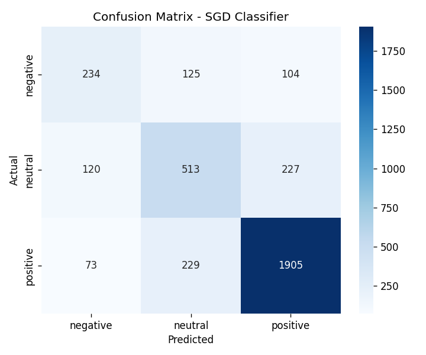
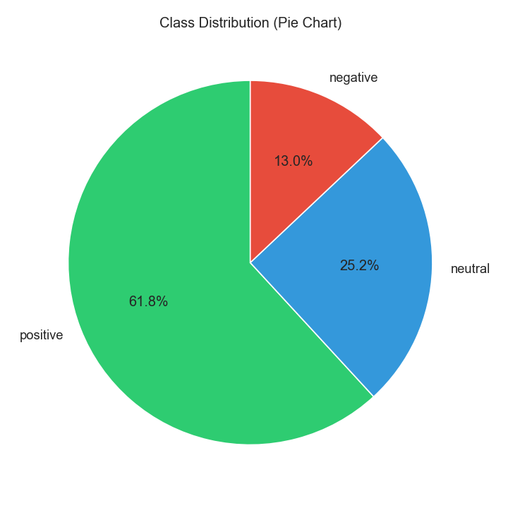

<div align="center">


# 🛰️ Sentiment Orbit
### YouTube Comment Sentiment Analysis — End-to-End ML System

*17,647 real YouTube comments → cleaned → vectorized → classified into Positive / Neutral / Negative*

<br>


<br>

**[🌐 Live 3D Dashboard](dashboard/sentiment_orbit_dashboard.html) · [📊 Model Results](#-model-leaderboard) · [🚀 Quick Start](#-quick-start) · [📡 API Docs](#-rest-api)**

</div>

<br>

---

## 🎯 What is this?

A production-style NLP system that reads a raw YouTube comment and predicts whether it's
**positive**, **negative**, or **neutral** — trained and benchmarked across **13 classical ML
models**, served through a **FastAPI** backend, and visualized in a custom **3D interactive
dashboard**.

Every number in this README came from actually running the pipeline on the real dataset —
not simulated, not cherry-picked.

<br>

## 🪐 The 3D Dashboard

<div align="center">

&nbsp;

</div>

<br>

Open `dashboard/sentiment_orbit_dashboard.html` in a browser for the full experience — a rotating 3D orbit of
sentiment classes, a live prediction box that talks to the FastAPI backend, an animated
model leaderboard, and interactive word clouds.

```bash
uvicorn app.main:app --reload      # start the backend
# then open dashboard/sentiment_orbit_dashboard.html in your browser
```

<br>

## 🧬 Pipeline Architecture

```mermaid
flowchart LR
    A[📄 Raw Comments<br/>18,409 rows] -->|drop nulls + dupes| B[🧹 Cleaned Data<br/>17,647 rows]
    B --> C[🔤 NLP Preprocessing<br/>lowercase · lemmatize · stopwords]
    C --> D[🧮 TF-IDF Vectorizer<br/>15,000 features · bigrams]
    D --> E[✂️ Stratified Split<br/>80% train / 20% test]
    E --> F[🤖 13 Models Trained]
    F --> G{Best by<br/>Macro F1}
    G --> H[🏆 SGD Classifier<br/>75.1% accuracy]
    H --> I[💾 Saved Pipeline<br/>joblib artifacts]
    I --> J[⚡ FastAPI /predict]
    J --> K[🛰️ 3D Dashboard]

    style A fill:#12172C,stroke:#8B93B5,color:#EAF0FF
    style H fill:#0c8f79,stroke:#2DE1C2,color:#fff
    style J fill:#12172C,stroke:#FFC857,color:#EAF0FF
    style K fill:#12172C,stroke:#FF5C7A,color:#EAF0FF
```



<br>

## 🏆 Model Leaderboard

13 classical ML algorithms trained on identical TF-IDF features, ranked by **macro F1**
(the fair metric given the 65% / 26% / 13% class imbalance):

| Rank | Model | Accuracy | Macro F1 | Train Time |
|:---:|---|:---:|:---:|:---:|
| 🥇 | **SGD Classifier** | **75.1%** | **0.659** | 0.10s |
| 🥈 | Logistic Regression | 72.8% | 0.654 | 0.37s |
| 🥉 | Extra Trees | 71.4% | 0.637 | 11.64s |
| 4 | Linear SVM | 74.6% | 0.630 | 0.41s |
| 5 | LightGBM | 73.6% | 0.620 | 18.91s |
| 6 | Random Forest | 69.8% | 0.614 | 11.73s |
| 7 | Passive Aggressive | 73.0% | 0.609 | 0.23s |
| 8 | XGBoost | 73.3% | 0.603 | 68.20s |
| 9 | Decision Tree | 61.2% | 0.537 | 1.58s |
| 10 | Gradient Boosting | 68.6% | 0.499 | 38.88s |
| 11 | Multinomial Naive Bayes | 67.5% | 0.438 | 0.00s |
| 12 | AdaBoost | 63.6% | 0.304 | 5.54s |
| 13 | KNN | 29.1% | 0.189 | 0.00s |

<details>
<summary><b>📊 Per-class performance of the winning model</b></summary>
<br>

| Class | Precision | Recall | F1 | Support |
|---|:---:|:---:|:---:|:---:|
| 🟢 Positive | 0.85 | 0.86 | **0.86** | 2,207 |
| 🟡 Neutral | 0.59 | 0.60 | **0.59** | 860 |
| 🔴 Negative | 0.55 | 0.51 | **0.53** | 463 |

**Honest limitation:** the model is noticeably weaker on Negative and Neutral comments —
a direct effect of class imbalance (only 13% of the data is Negative). This is the natural
target for future work (class-weighted loss, oversampling, or contextual embeddings).

</details>

<br>

## 📁 Project Structure

```
youtube_sentiment_analysis/
├── 📂 data/
│   ├── raw/                  → original Kaggle dataset
│   └── processed/            → cleaned + lemmatized comments
├── 📂 notebooks/
│   ├── 01_data_understanding_eda.py
│   └── figures/              → 11 EDA charts & word clouds
├── 📂 src/
│   ├── preprocessing.py      → NLP cleaning pipeline
│   ├── feature_engineering.py→ TF-IDF / BoW
│   ├── train.py              → trains & compares 13 models
│   ├── evaluate.py           → reproducible evaluation
│   └── predict.py            → inference module
├── 📂 models/                → saved vectorizer, encoder, best model
├── 📂 app/
│   └── main.py                → FastAPI backend
├── 📂 dashboard/
│   └── sentiment_orbit_dashboard.html → 3D interactive dashboard
├── 📂 tests/                 → 16 unit + model + API tests
├── 📂 config/
├── 🐳 Dockerfile
└── 📄 requirements.txt
```

<br>

## 🚀 Quick Start

```bash
# 1. Clone & install
git clone https://github.com/mawiya-47/Youtube-Sentiment-Dashboard.git
cd Youtube-Sentiment-Dashboard
pip install -r requirements.txt
python -m nltk.downloader stopwords wordnet omw-1.4

# 2. (optional) re-run the full pipeline — trained artifacts are already in models/
python notebooks/01_data_understanding_eda.py
python src/train.py

# 3. Try a prediction from the CLI
python src/predict.py

# 4. Run the test suite
pytest tests/ -v

# 5. Start the API
uvicorn app.main:app --reload
```

**🐳 Or with Docker:**
```bash
docker build -t sentiment-orbit .
docker run -p 8000:8000 sentiment-orbit
```

<br>

## 📡 REST API

| Endpoint | Method | Description |
|---|:---:|---|
| `/health` | `GET` | liveness check |
| `/model-info` | `GET` | model metadata + full comparison table |
| `/predict` | `POST` | `{"comment": "..."}` → sentiment + confidence |
| `/predict-batch` | `POST` | `{"comments": [...]}` — up to 200 at once |
| `/retrain` | `POST` | re-runs the full training pipeline |
| `/docs` | `GET` | interactive Swagger UI |

```bash
curl -X POST http://localhost:8000/predict \
  -H "Content-Type: application/json" \
  -d '{"comment": "this tutorial was absolutely fantastic!"}'
```
```json
{
  "predicted_sentiment": "positive",
  "confidence": 0.8167,
  "probabilities": { "positive": 0.8167, "neutral": 0.1177, "negative": 0.0656 }
}
```

<br>

## 🧠 Tech Stack


<br>

## 🔭 Future Scope

- 🧠 Deep learning: LSTM, BiLSTM, CNN-for-text, DistilBERT, RoBERTa
- 🧮 Embeddings: Word2Vec, FastText, Sentence-Transformers
- 🎛️ Hyperparameter tuning: GridSearchCV, Optuna
- 🔍 Interpretability: SHAP, LIME
- ☁️ Cloud deployment: Render, Railway, AWS, Azure, GCP, HuggingFace Spaces
- ⚖️ Class-imbalance handling to boost Negative/Neutral recall

<br>

## 📄 License

MIT — free to use for learning, portfolio, and experimentation.

<br>

<div align="center">

**Built with real data, honest metrics, and no shortcuts.**

⭐ If this helped you, consider starring the repo!

</div>
